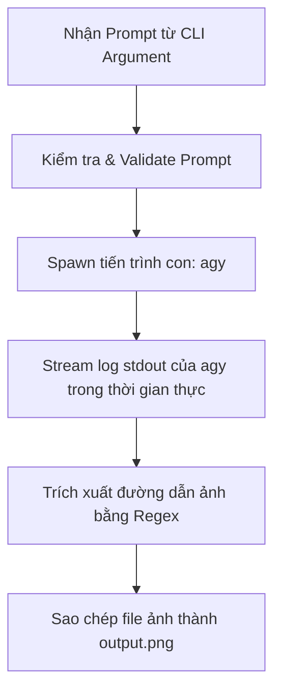

# Hướng Dẫn Hoạt Động - Bun CLI Image Generator

Dự án này là một ứng dụng dòng lệnh (CLI) được viết bằng **TypeScript** chạy trên runtime **Bun**. Ứng dụng giúp tự động hóa việc gọi CLI của Antigravity (`agy`), theo dõi tiến trình tạo ảnh, tìm đường dẫn ảnh được tạo ra và sao chép ảnh đó về thư mục làm việc hiện tại dưới tên `output.png`.

---

## 1. Cách Sử Dụng

### Điều kiện tiên quyết:
- Đã cài đặt **Bun** trên máy.
- Đã cài đặt CLI **Antigravity** (command là `agy`).

### Lệnh chạy:
```bash
cd agkitpic
bun run src/index.ts "mô tả ảnh bạn muốn tạo ở đây"
```
Ví dụ:
```bash
bun run src/index.ts "một quả táo màu xanh trên bàn gỗ"
```

---

## 2. Cách Thức Hoạt Động (Dưới Vỏ Bọc)

Quy trình hoạt động của mã nguồn trong `src/index.ts` diễn ra qua 5 bước chính:



### Bước 2.1: Nhận diện và kiểm tra tham số đầu vào
Ứng dụng kiểm tra xem người dùng có truyền vào prompt tạo ảnh hay không bằng cách đọc tham số thông qua `Bun.argv`:
```typescript
if (Bun.argv.length < 3) {
  console.error("Error: Please provide a prompt in quotes.");
  process.exit(1);
}
```
- `Bun.argv[0]`: Đường dẫn của bun runtime.
- `Bun.argv[1]`: Đường dẫn của file script đang chạy (`src/index.ts`).
- `Bun.argv[2]`: Tham số đầu tiên do người dùng truyền vào (chính là Prompt tạo ảnh).

### Bước 2.2: Gọi Tiến Trình Con (`Bun.spawn`)
Ứng dụng sử dụng API hiệu năng cao `Bun.spawn` để kích hoạt CLI `agy` chạy độc lập ngoài nền hệ thống:
```typescript
const child = Bun.spawn(["agy", "--print", `tạo ảnh: ${prompt}`, "--dangerously-skip-permissions"], {
  stdout: "pipe", // Truyền luồng đầu ra stdout để đọc dữ liệu
  stderr: "inherit", // Cho phép in lỗi stderr trực tiếp ra terminal
});
```
*Lưu ý:* Tham số `--dangerously-skip-permissions` là bắt buộc để CLI tự động đồng ý các quyền tạo ảnh mà không dừng lại chờ người dùng nhập xác nhận ở cửa sổ tương tác stdin.

### Bước 2.3: Đọc và hiển thị Log thời gian thực (Log Streaming)
Tiến trình tạo ảnh của LLM có thể mất từ vài giây đến một phút. Ứng dụng đọc luồng dữ liệu `stdout` của CLI theo từng cụm dữ liệu nhỏ (chunk) thông qua một `ReadableStreamDefaultReader` và in trực tiếp ra màn hình:
```typescript
const reader = child.stdout.getReader();
const decoder = new TextDecoder();
let accumulatedStdout = "";

while (true) {
  const { done, value } = await reader.read();
  if (done) break;
  const chunk = decoder.decode(value, { stream: true });
  process.stdout.write(chunk); // In log ra terminal ngay lập tức
  accumulatedStdout += chunk;  // Lưu lại toàn bộ log để phân tích sau
}
```

### Bước 2.4: Trích xuất đường dẫn ảnh bằng Regex
Khi CLI `agy` hoàn thành, LLM sẽ trả về đường dẫn tới file ảnh đã được tạo (dưới dạng Markdown hoặc đường dẫn Windows). Hàm `parseImagePath` sử dụng hai mẫu Regex để tìm ra đường dẫn tuyệt đối của file ảnh trong đoạn text log (`accumulatedStdout`):

1. **Regex 1 (Dạng URL):** Nhận diện định dạng URL file như `file:///C:/path/to/image.png`.
2. **Regex 2 (Dạng path thông thường):** Nhận diện đường dẫn Windows trực tiếp như `C:\path\to\image.png`.

```typescript
export function parseImagePath(text: string): string | null {
  const fileUrlRegex = /file:\/\/\/([a-zA-Z]:[^\s\)]+\.(?:png|jpg|jpeg|webp))/gi;
  const matchUrl = fileUrlRegex.exec(text);
  if (matchUrl) return matchUrl[1].replace(/\\/g, "/");

  const winPathRegex = /([a-zA-Z]:[\/\\][^\s\)]+\.(?:png|jpg|jpeg|webp))/gi;
  const matchPath = winPathRegex.exec(text);
  if (matchPath) return matchPath[1].replace(/\\/g, "/");

  return null;
}
```

### Bước 2.5: Sao chép ảnh về thư mục hiện tại (`copyImageToDest`)
Sau khi lấy được đường dẫn tuyệt đối của ảnh nguồn, ứng dụng kiểm tra sự tồn tại của file và sao chép nó về thư mục hiện tại dưới tên `output.png` bằng File API của Bun:
```typescript
export async function copyImageToDest(imagePath: string, destPath: string): Promise<boolean> {
  const srcFile = Bun.file(imagePath);
  if (await srcFile.exists()) {
    await Bun.write(destPath, srcFile); // Ghi file hiệu năng cao
    return true;
  }
  return false;
}
```

---

## 3. Hệ Thống Kiểm Thử (Unit Tests)

Mã nguồn được viết theo mô hình TDD (Test-Driven Development) và có đầy đủ test suite trong thư mục `tests/index.test.ts`. 

Bạn có thể chạy thử nghiệm bằng lệnh:
```bash
bun test
```

### Các kịch bản kiểm thử:
1. **Kiểm tra tham số:** Đảm bảo ứng dụng thoát lỗi và in hướng dẫn khi không nhận được prompt.
2. **Kiểm tra Regex:** Đảm bảo hàm trích xuất nhận dạng đúng cả hai loại đường dẫn (URL chứa `file:///` và đường dẫn Windows thông thường chứa dấu `\`).
3. **Kiểm tra sao chép file:**
   - Tạo một file ảnh giả lập -> Gọi hàm copy -> Đảm bảo file được copy thành công và nội dung chính xác.
   - Thử copy file không tồn tại -> Đảm bảo hàm trả về `false` và không gây crash ứng dụng.
